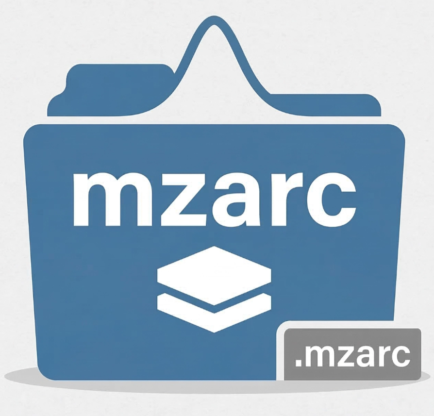

<p align="center">
    
</p>

<h1 align="center">mzarc</h1>

<p align="center">
    Feasibility-first compression prototype for mzML-derived mass spectrometry spectra.
</p>

<p align="center">
    Current version: <strong>v0.1.1</strong> &mdash; Phase 1 complete
</p>

<p align="center">
    <a href="#current-state"></a>
    <a href="#development"></a>
    <a href="#development"></a>
    <a href="#current-state"></a>
    <a href="#development"></a>
</p>

---

## What This Repository Is

`mzarc` is a small, build-first experiment around one question:

Can we take real spectra from mzML, move them into a simple binary handoff format, and then prove that a domain-specific scalar codec is worth continuing?

That is the current scope. This repository is not trying to be the final mass spectrometry container yet. It is trying to produce clean evidence.

Right now the pipeline is intentionally narrow:

`mzML -> Python dump tool -> flat binary dump -> Zig scalar transforms -> V1 block prototype`

The point of this shape is to keep XML parsing and codec work separate. Python handles mzML ingestion once. Zig handles the actual transform and decode work repeatedly.

---

## Current State

This repository is at `v0.1.1`. Phase 1 ("Prove the Thesis") is complete.

What exists today:

- real mzML ingestion through `pyteomics`
- flat binary dump generation in `tools/mzml_dump.py`
- dump inspection in `tools/inspect_dump.py`
- Zig dump reader and writer in `src/binary_reader.zig`
- scalar m/z quantization in `src/quantize.zig`
- scalar intra-spectrum delta coding in `src/delta.zig`
- scalar frame-of-reference bit-packing in `src/bitpack.zig`
- composed block encoder and decoder in `src/block.zig`
- codec layer in `src/codec.zig` that stores `.mzarc` files with MS1/MS2 block streams
- a CLI in `src/main.zig` with dump inspection plus `.mzarc` encode, decode, and inspect commands
- 41 unit tests covering every layer, all passing
- a reproducible benchmark suite in `tools/` comparing against gzip, zstd, bzip2, lz4, xz, mzMLb, MS-Numpress, and MScompress

What this means in practice:

- lossless `.mzarc` is **20.23 MiB** on `15HCD_1.mzML` (75.55 MiB), smaller than gzip+mzML (24.29 MiB) and MScompress (21.63 MiB)
- the lossless path is bit-exact: mean absolute m/z error is `0.0` and original global scan order is preserved
- encode throughput is ~161 MiB/s and decode throughput is ~205 MiB/s in `ReleaseFast`
- mzMLb (16.25 MiB) and xz dump (15.77 MiB) are still smaller — expected at the scalar codec stage; Phase 2 SIMD + cross-spectrum delta is next

What Phase 2 will address:

- SIMD-native decoding and cross-spectrum delta to close the gap with mzMLb
- formal per-spectrum fidelity analysis
- pymzarc Python bindings

---

## What Phase 1 Proved

1. mzML ingestion does not need to be written in Zig for the prototype to move forward.
2. A flat binary handoff format is enough to isolate codec work from XML overhead.
3. A scalar FOR + bit-pack transform chain can beat gzip+mzML without an outer compression layer.
4. The lossless path can be bit-exact while still achieving meaningful size reduction.

The thesis holds. The repository earned the right to move to Phase 2.

---

## What Is Implemented Right Now

### Python ingress

- `tools/mzml_dump.py` reads mzML with `pyteomics`, normalizes arrays, and writes a flat dump format.
- `tools/inspect_dump.py` validates the dump and reports counts and peak statistics.

### Zig prototype core

- `src/binary_reader.zig` reads and writes the dump format.
- `src/quantize.zig` handles m/z fixed-point conversion and lossy log-intensity quantization.
- `src/delta.zig` handles intra-spectrum delta encode and decode.
- `src/bitpack.zig` handles scalar frame-of-reference packing and unpacking.
- `src/block.zig` composes the above into a real block encoder and decoder with CRC32 validation.
- `src/codec.zig` stores `.mzarc` files with block streams for MS1 and MS2 and supports encode, decode, and inspect operations.

### Benchmarking

- `tools/benchmark_v1.py` benchmarks mzML ingest, `.mzarc` encode and decode, size, round-trip fidelity, and repeated timing intervals with confidence bounds.
- [benchmark/report.md](benchmark/report.md) contains the current public benchmark summary and plot references.
- [benchmark/report.json](benchmark/report.json) contains the machine-readable benchmark output.
- repo-root `benchmark/` contains the pushable report and plots.
- ignored `data/.../benchmarks/...` stores generated dumps, round-trips, and encoded intermediates.

### Current benchmark snapshot

- On `data/PXD075509/15HCD_1.mzML` (75.55 MiB), lossless `.mzarc` is **20.23 MiB** (73.2% smaller than mzML, comparable with gzip dump at 19.82 MiB).
- Beats both MScompress (`21.63 MiB`) and gzip+mzML (`24.29 MiB`) without any outer compression layer.
- mzMLb (`16.25 MiB`) and xz dump (`15.77 MiB`) are still smaller — closing this gap is the primary Phase 2 target.
- Over 3 `ReleaseFast` runs, lossless encode averages `0.191s` (~161 MiB/s) and decode averages `0.150s` (~205 MiB/s).
- The lossless path is bit-exact: mean absolute m/z error is `0.0`, intensity is exact, original global scan order preserved.

### Validation

- unit tests cover dump IO, quantization, delta coding, bit-packing, and block round-trips
- the current CLI can encode, decode, and inspect a real `.mzarc` file end-to-end, including byte-breakdown inspection
- the checked-in benchmark report currently uses `10` timing repeats per operation and records means, standard deviations, and two-sided 95% confidence intervals on real mzML input

---

## What Comes Next

Phase 1 is complete. Phase 2 focus areas:

1. SIMD-native encode/decode to cut the gap with mzMLb and xz
2. cross-spectrum delta compression on the m/z stream, which currently dominates artifact size
3. pymzarc Python bindings via Zig C ABI
4. a second, more representative DIA dataset to validate generalization
5. downstream search-impact measurements (peptide IDs, FDR) alongside numeric fidelity

---

## Repository Layout

```text
mzarc/
├── build.zig
├── build.zig.zon
├── benchmark/
│   ├── report.json
│   ├── report.md
│   └── plots/
├── pyproject.toml
├── src/
│   ├── binary_reader.zig
│   ├── bitpack.zig
│   ├── block.zig
│   ├── codec.zig
│   ├── delta.zig
│   ├── main.zig
│   └── quantize.zig
├── test/
│   ├── test_binary_reader.zig
│   ├── test_bitpack.zig
│   ├── test_block.zig
│   ├── test_codec.zig
│   ├── test_delta.zig
│   └── test_quantize.zig
└── tools/
    ├── benchmark_core.py
    ├── benchmark_external.py
    ├── benchmark_metrics.py
    ├── benchmark_plotting.py
    ├── benchmark_report.py
    ├── benchmark_v1.py
    ├── inspect_dump.py
    └── mzml_dump.py
```

This tree is intentionally small. More files should only appear when the next working slice demands them.

---

## Development

Python is managed with `uv`, pinned to Python `3.12`.

The Zig toolchain is repo-local and should be used explicitly:

```bash
export ZIG="$PWD/zig-x86_64-linux-0.16.0-dev.2905+5d71e3051/zig"
uv sync
$ZIG build test
$ZIG build
$ZIG build -Doptimize=ReleaseFast
```

Current working commands:

```bash
uv run python tools/mzml_dump.py data/PXD075509/15HCD_1.mzML -o data/PXD075509/15HCD_1.bin
uv run python tools/inspect_dump.py data/PXD075509/15HCD_1.bin
./zig-out/bin/mzarc dump-inspect data/PXD075509/15HCD_1.bin
./zig-out/bin/mzarc encode data/PXD075509/15HCD_1.bin -o data/PXD075509/15HCD_1.lossless.mzarc
./zig-out/bin/mzarc decode data/PXD075509/15HCD_1.lossless.mzarc -o data/PXD075509/15HCD_1.roundtrip.bin
$ZIG build -Doptimize=ReleaseFast
uv run python tools/benchmark_v1.py data/PXD075509/15HCD_1.mzML --build --repeats 3 --external-baselines all --public-dir benchmark
```

The important rule for this stage is simple: every new step should leave behind a runnable command and a testable artifact.

---

## License

MIT. See [LICENSE](LICENSE) for details.

---

<br />

<p align="center">
    <em>
        Ions drift to ground<br />
        Folded into bit-packed frames—<br />
        The machine breathes light.
    </em>
</p>
