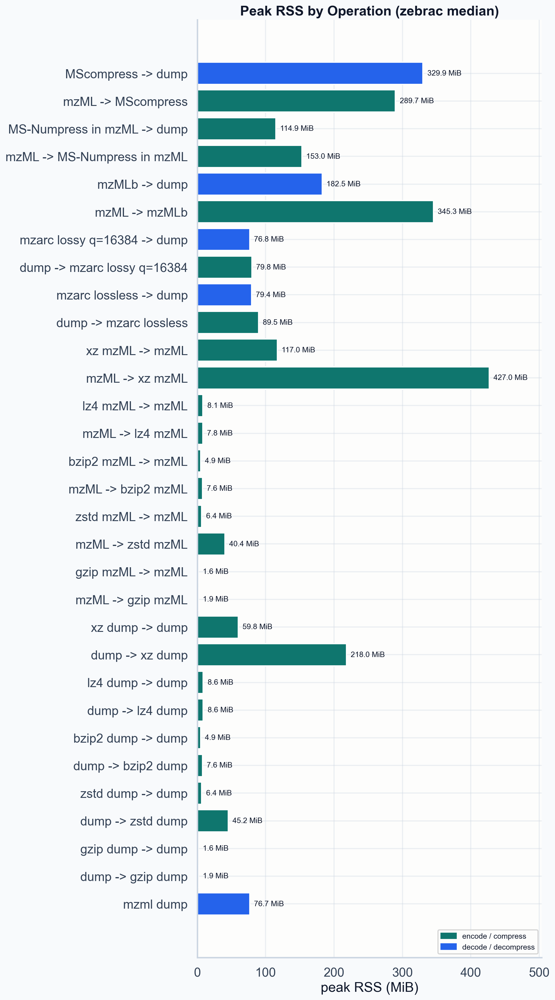
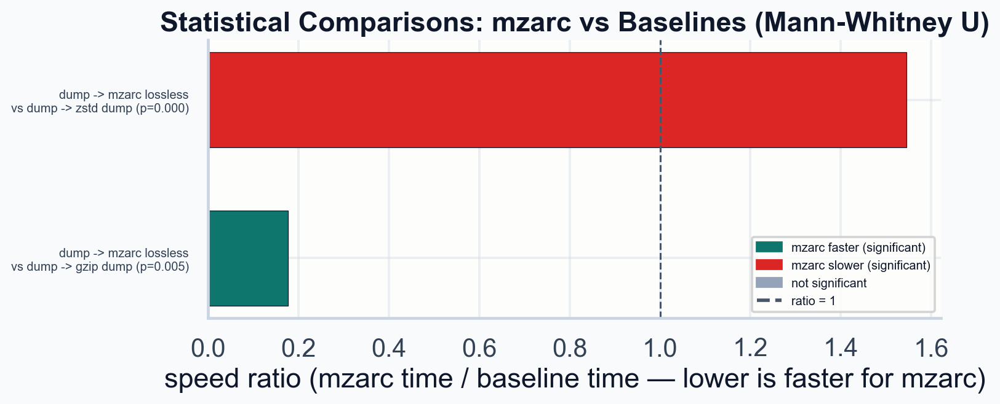

# Benchmark Report: 15HCD_1

- mzML input: data/PXD075509/15HCD_1.mzML
- private workdir: data/PXD075509/benchmarks/15HCD_1
- public output dir: benchmark
- repeats: n/a
- selected lossy intensity quantization: q=16384

## Story

The flat dump is smaller than mzML because it strips almost all interchange overhead: XML structure, controlled-vocabulary markup, base64 wrapping, and general-purpose metadata that this prototype does not need for codec bring-up. That makes the dump a useful internal floor, not a format competitor by itself.

This benchmark focuses on two things that matter right now: whether the current `.mzarc` path buys meaningful size reduction over the interchange format, and whether encode and decode stay fast and stable across repeated runs.

No external formats ran end-to-end in this benchmark.

## Dataset

- spectra: 9001
- total peaks: 2668458
- ms1 spectra: 917
- ms2 spectra: 8084

## Size Comparison

| artifact | bytes | size | vs mzML | vs dump |
| --- | ---: | ---: | ---: | ---: |
| mzML | 79221306 | 75.55 MiB | 100.00% | 245.47% |
| dump | 32273524 | 30.78 MiB | 40.74% | 100.00% |
| gzip dump | 20780851 | 19.82 MiB | 26.23% | 64.39% |
| zstd dump | 18720327 | 17.85 MiB | 23.63% | 58.01% |
| bzip2 dump | 19719837 | 18.81 MiB | 24.89% | 61.10% |
| lz4 dump | 26038757 | 24.83 MiB | 32.87% | 80.68% |
| xz dump | 16535444 | 15.77 MiB | 20.87% | 51.24% |
| gzip mzML | 25465391 | 24.29 MiB | 32.14% | 78.90% |
| zstd mzML | 24770559 | 23.62 MiB | 31.27% | 76.75% |
| bzip2 mzML | 24720971 | 23.58 MiB | 31.20% | 76.60% |
| lz4 mzML | 34826833 | 33.21 MiB | 43.96% | 107.91% |
| xz mzML | 24536980 | 23.40 MiB | 30.97% | 76.03% |
| mzarc lossless | 16016009 | 15.27 MiB | 20.22% | 49.63% |
| mzarc lossy q=16384 | 13233307 | 12.62 MiB | 16.70% | 41.00% |
| mzMLb | 17038178 | 16.25 MiB | 21.51% | 52.79% |
| MS-Numpress in mzML | 69905308 | 66.67 MiB | 88.24% | 216.60% |
| MScompress | 22679622 | 21.63 MiB | 28.63% | 70.27% |

Lossless `.mzarc` is already materially smaller than mzML on this sample, and it slightly beats `gzip` on the dump baseline while still trailing `zstd` on the dump. The selected lossy mode gives a controlled next step down in size without the catastrophic saturation behavior that the earlier intensity quantizer had.

## Byte Composition

| artifact | structural bytes | spectrum metadata | m/z stream | intensity stream | total |
| --- | ---: | ---: | ---: | ---: | ---: |
| mzarc lossless | 0.04 MiB (0.24%) | 0.15 MiB (1.00%) | 6.81 MiB (44.61%) | 8.27 MiB (54.15%) | 15.27 MiB |
| mzarc lossy q=16384 | 0.04 MiB (0.29%) | 0.15 MiB (1.20%) | 7.99 MiB (63.35%) | 4.44 MiB (35.15%) | 12.62 MiB |

The lossless byte breakdown shows whether the size regression is real payload or container overhead. On this run, the intensity stream is the largest component at 8.27 MiB, which keeps the diagnosis grounded in actual encoded bytes rather than guesswork.

## Performance Overview

| artifact | direction | status | throughput | median time | timing source | source format | notes |
| --- | --- | --- | ---: | ---: | --- | --- | --- |
| gzip dump | compression | measured | 11.89 MiB/s | 1.6672s | zebrac | dump |  |
| gzip dump | decompression | measured | 142.9 MiB/s | 0.21543s | zebrac | gzip dump |  |
| zstd dump | compression | measured | 92.68 MiB/s | 0.19263s | zebrac | dump |  |
| zstd dump | decompression | measured | 474.7 MiB/s | 0.064831s | zebrac | zstd dump |  |
| bzip2 dump | compression | measured | 6.916 MiB/s | 2.7191s | zebrac | dump |  |
| bzip2 dump | decompression | measured | 20.69 MiB/s | 1.4873s | zebrac | bzip2 dump |  |
| lz4 dump | compression | measured | 294.1 MiB/s | 0.084422s | zebrac | dump |  |
| lz4 dump | decompression | measured | 464.2 MiB/s | 0.066311s | zebrac | lz4 dump |  |
| xz dump | compression | measured | 1.297 MiB/s | 12.158s | zebrac | dump |  |
| xz dump | decompression | measured | 59.68 MiB/s | 0.51573s | zebrac | xz dump |  |
| gzip mzML | compression | measured | 15.73 MiB/s | 1.5439s | zebrac | mzML |  |
| gzip mzML | decompression | measured | 196.6 MiB/s | 0.38438s | zebrac | gzip mzML |  |
| zstd mzML | compression | measured | 130 MiB/s | 0.18175s | zebrac | mzML |  |
| zstd mzML | decompression | measured | 958.4 MiB/s | 0.078827s | zebrac | zstd mzML |  |
| bzip2 mzML | compression | measured | 3.304 MiB/s | 7.135s | zebrac | mzML |  |
| bzip2 mzML | decompression | measured | 30.15 MiB/s | 2.5059s | zebrac | bzip2 mzML |  |
| lz4 mzML | compression | measured | 313.7 MiB/s | 0.10589s | zebrac | mzML |  |
| lz4 mzML | decompression | measured | 674.2 MiB/s | 0.11206s | zebrac | lz4 mzML |  |
| xz mzML | compression | measured | 4.307 MiB/s | 5.4331s | zebrac | mzML |  |
| xz mzML | decompression | measured | 190.9 MiB/s | 0.39584s | zebrac | xz mzML |  |
| mzarc lossless | compression | measured | 51.39 MiB/s | 0.29725s | zebrac | dump |  |
| mzarc lossless | decompression | measured | 152.3 MiB/s | 0.20206s | zebrac | mzarc lossless |  |
| mzarc lossy q=16384 | compression | measured | 31.5 MiB/s | 0.40065s | zebrac | dump |  |
| mzarc lossy q=16384 | decompression | measured | 137.7 MiB/s | 0.22358s | zebrac | mzarc lossy q=16384 |  |

## Memory and CPU Metrics

The following metrics were collected by zebrac, which runs each command repeatedly over a fixed duration window using Linux perf counters. Reported values are medians across all samples in the window. Peak RSS is the highest resident set size observed for that process. Instructions and cache misses are per-run hardware counter readings.

| operation | wall time (median) | peak RSS (median) | peak RSS (min) | instructions (median) | cache misses (median) | samples |
| --- | ---: | ---: | ---: | ---: | ---: | ---: |
| mzml dump | 4.962s | 76.7 MiB | 76.4 MiB | 3.18e+10 | 4.1e+08 | 3 |
| dump -> gzip dump | 1.667s | 1.9 MiB | 1.9 MiB | 9.86e+09 | 2.39e+06 | 3 |
| gzip dump -> dump | 0.2154s | 1.6 MiB | 1.6 MiB | 1.26e+09 | 2.07e+05 | 14 |
| dump -> zstd dump | 0.1926s | 45.2 MiB | 44.9 MiB | 1.35e+09 | 3.55e+07 | 16 |
| zstd dump -> dump | 0.06483s | 6.4 MiB | 6.2 MiB | 5.22e+08 | 9.79e+05 | 46 |
| dump -> bzip2 dump | 2.719s | 7.6 MiB | 7.6 MiB | 1.91e+10 | 9.57e+07 | 3 |
| bzip2 dump -> dump | 1.487s | 4.9 MiB | 4.9 MiB | 6.85e+09 | 3.65e+07 | 3 |
| dump -> lz4 dump | 0.08442s | 8.6 MiB | 8.3 MiB | 5.96e+08 | 7.91e+04 | 36 |
| lz4 dump -> dump | 0.06631s | 8.6 MiB | 8.6 MiB | 1.8e+08 | 3.09e+05 | 45 |
| dump -> xz dump | 12.16s | 218.0 MiB | 218.0 MiB | 5.08e+10 | 4.2e+08 | 3 |
| xz dump -> dump | 0.5157s | 59.8 MiB | 59.4 MiB | 4.5e+09 | 1.44e+06 | 6 |
| mzML -> gzip mzML | 1.544s | 1.9 MiB | 1.9 MiB | 8.83e+09 | 1e+06 | 3 |
| gzip mzML -> mzML | 0.3844s | 1.6 MiB | 1.4 MiB | 1.89e+09 | 2.93e+05 | 8 |
| mzML -> zstd mzML | 0.1817s | 40.4 MiB | 39.9 MiB | 1.15e+09 | 3.64e+07 | 17 |
| zstd mzML -> mzML | 0.07883s | 6.4 MiB | 6.2 MiB | 4.67e+08 | 1.83e+06 | 38 |
| mzML -> bzip2 mzML | 7.135s | 7.6 MiB | 7.6 MiB | 5.65e+10 | 3.71e+08 | 3 |
| bzip2 mzML -> mzML | 2.506s | 4.9 MiB | 4.9 MiB | 9.49e+09 | 7.86e+07 | 3 |
| mzML -> lz4 mzML | 0.1059s | 7.8 MiB | 7.8 MiB | 4.93e+08 | 2.29e+05 | 29 |
| lz4 mzML -> mzML | 0.1121s | 8.1 MiB | 8.1 MiB | 2.27e+08 | 6.39e+05 | 27 |
| mzML -> xz mzML | 5.433s | 427.0 MiB | 426.7 MiB | 6.27e+10 | 2.81e+08 | 3 |
| xz mzML -> mzML | 0.3958s | 117.0 MiB | 116.5 MiB | 7.2e+09 | 2.13e+06 | 8 |
| dump -> mzarc lossless | 0.2972s | 89.5 MiB | 89.2 MiB | 1.36e+09 | 6.16e+05 | 11 |
| mzarc lossless -> dump | 0.2021s | 79.4 MiB | 79.2 MiB | 9.25e+08 | 2.46e+05 | 15 |
| dump -> mzarc lossy q=16384 | 0.4007s | 79.8 MiB | 79.8 MiB | 2.31e+09 | 5.78e+05 | 8 |
| mzarc lossy q=16384 -> dump | 0.2236s | 76.8 MiB | 76.4 MiB | 1.17e+09 | 2.44e+05 | 14 |
| mzML -> mzMLb | 23.93s | 345.3 MiB | 333.6 MiB | 1.41e+11 | 2.1e+09 | 3 |
| mzMLb -> dump | 5.333s | 182.5 MiB | 181.1 MiB | 3.4e+10 | 4.15e+08 | 3 |
| mzML -> MS-Numpress in mzML | 24.28s | 153.0 MiB | 152.7 MiB | 1.37e+11 | 2.44e+09 | 3 |
| MS-Numpress in mzML -> dump | 6.394s | 114.9 MiB | 114.5 MiB | 3.97e+10 | 5.42e+08 | 3 |
| mzML -> MScompress | 0.8809s | 289.7 MiB | 289.5 MiB | 4.89e+09 | 6.64e+07 | 4 |
| MScompress -> dump | 7.519s | 329.9 MiB | 329.8 MiB | 4.55e+10 | 3.98e+08 | 3 |

## Zebrac Statistics

All internal operations are timed by zebrac, which runs each command repeatedly over a fixed duration window using Linux perf counters. Reported wall times are medians across all samples in the window. CI 95% bounds are bootstrap confidence intervals on the median, synthesised from a log-normal distribution fitted to zebrac's summary statistics.

| operation | median | stddev | CI 95% lo | CI 95% hi | IQR | min | max | n |
| --- | ---: | ---: | ---: | ---: | ---: | ---: | ---: | ---: |
| mzml dump | 4.962s | 0.06554s | 4.954s | 5.072s | 0.1174s | 4.954s | 5.072s | 3 |
| dump -> gzip dump | 1.667s | 0.01409s | 1.657s | 1.685s | 0.02789s | 1.657s | 1.685s | 3 |
| gzip dump -> dump | 0.2154s | 0.001493s | 0.2153s | 0.2171s | 0.002583s | 0.2138s | 0.218s | 14 |
| dump -> zstd dump | 0.1926s | 0.002542s | 0.1915s | 0.194s | 0.003943s | 0.1892s | 0.1968s | 16 |
| zstd dump -> dump | 0.06483s | 0.00368s | 0.06418s | 0.06712s | 0.006325s | 0.06064s | 0.07388s | 46 |
| dump -> bzip2 dump | 2.719s | 0.02738s | 2.69s | 2.745s | 0.05473s | 2.69s | 2.745s | 3 |
| bzip2 dump -> dump | 1.487s | 0.0241s | 1.483s | 1.527s | 0.04362s | 1.483s | 1.527s | 3 |
| dump -> lz4 dump | 0.08442s | 0.001741s | 0.08438s | 0.08545s | 0.001444s | 0.08133s | 0.08927s | 36 |
| lz4 dump -> dump | 0.06631s | 0.002116s | 0.06608s | 0.0676s | 0.001734s | 0.06408s | 0.07692s | 45 |
| dump -> xz dump | 12.16s | 0.05219s | 12.14s | 12.24s | 0.09894s | 12.14s | 12.24s | 3 |
| xz dump -> dump | 0.5157s | 0.004235s | 0.513s | 0.5181s | 0.008097s | 0.5087s | 0.5208s | 6 |
| mzML -> gzip mzML | 1.544s | 0.005348s | 1.541s | 1.551s | 0.01048s | 1.541s | 1.551s | 3 |
| gzip mzML -> mzML | 0.3844s | 0.004501s | 0.3796s | 0.3875s | 0.002546s | 0.3737s | 0.3898s | 8 |
| mzML -> zstd mzML | 0.1817s | 0.002459s | 0.1799s | 0.1821s | 0.004512s | 0.1779s | 0.1862s | 17 |
| zstd mzML -> mzML | 0.07883s | 0.00206s | 0.07832s | 0.08031s | 0.00189s | 0.07557s | 0.08493s | 38 |
| mzML -> bzip2 mzML | 7.135s | 0.09403s | 7.057s | 7.245s | 0.1871s | 7.057s | 7.245s | 3 |
| bzip2 mzML -> mzML | 2.506s | 0.01775s | 2.478s | 2.511s | 0.0328s | 2.478s | 2.511s | 3 |
| mzML -> lz4 mzML | 0.1059s | 0.001481s | 0.1055s | 0.1072s | 0.002221s | 0.1037s | 0.1098s | 29 |
| lz4 mzML -> mzML | 0.1121s | 0.002157s | 0.1113s | 0.114s | 0.00195s | 0.1105s | 0.1213s | 27 |
| mzML -> xz mzML | 5.433s | 0.06854s | 5.332s | 5.462s | 0.1306s | 5.332s | 5.462s | 3 |
| xz mzML -> mzML | 0.3958s | 0.004522s | 0.3915s | 0.3994s | 0.005094s | 0.3898s | 0.4042s | 8 |
| dump -> mzarc lossless | 0.2972s | 0.00212s | 0.2959s | 0.2984s | 0.002214s | 0.2923s | 0.2991s | 11 |
| mzarc lossless -> dump | 0.2021s | 0.0025s | 0.2015s | 0.2047s | 0.004408s | 0.1996s | 0.2079s | 15 |
| dump -> mzarc lossy q=16384 | 0.4007s | 0.003786s | 0.3962s | 0.4028s | 0.005077s | 0.394s | 0.4059s | 8 |
| mzarc lossy q=16384 -> dump | 0.2236s | 0.00194s | 0.223s | 0.2254s | 0.003049s | 0.2211s | 0.2276s | 14 |
| mzML -> mzMLb | 23.93s | 0.2089s | 23.82s | 24.22s | 0.4055s | 23.82s | 24.22s | 3 |
| mzMLb -> dump | 5.333s | 0.0171s | 5.33s | 5.361s | 0.03132s | 5.33s | 5.361s | 3 |
| mzML -> MS-Numpress in mzML | 24.28s | 0.1291s | 24.06s | 24.29s | 0.2285s | 24.06s | 24.29s | 3 |
| MS-Numpress in mzML -> dump | 6.394s | 0.03137s | 6.34s | 6.394s | 0.05447s | 6.34s | 6.394s | 3 |
| mzML -> MScompress | 0.8809s | 0.01991s | 0.8831s | 0.8938s | 0.04082s | 0.863s | 0.9064s | 4 |
| MScompress -> dump | 7.519s | 0.001676s | 7.518s | 7.521s | 0.003316s | 7.518s | 7.521s | 3 |

## Statistical Comparisons

Mann-Whitney U tests compare mzarc lossless encode wall-time distributions against each general-purpose codec baseline. Wilcoxon signed-rank test compares mzarc encode vs decode. Distributions are synthesised from zebrac summary statistics via log-normal sampling (log-normal is appropriate for execution-time data). p-values below 0.05 are considered significant.

| operation A | operation B | type | speed ratio | p-value | significant |
| --- | --- | --- | ---: | ---: | --- |
| dump -> mzarc lossless | dump -> gzip dump | encode_vs_baseline | 0.176 | 0.005495 | yes |
| dump -> mzarc lossless | dump -> zstd dump | encode_vs_baseline | 1.55 | 1.571e-05 | yes |
| dump -> mzarc lossless | mzarc lossless -> dump | encode_vs_decode | n/a | 1.264e-83 | yes |

## External Baselines

No external baselines were requested for this run.

## Data Fidelity

| artifact | status | global order | max abs m/z | max ppm m/z | mean abs intensity | max abs intensity | p95 rel intensity | notes |
| --- | --- | ---: | ---: | ---: | ---: | ---: | ---: | --- |
| lz4 dump | measured | true | 0 | 0 | 0 | 0 | 0.000% |  |
| gzip dump | measured | true | 0 | 0 | 0 | 0 | 0.000% |  |
| zstd dump | measured | true | 0 | 0 | 0 | 0 | 0.000% |  |
| bzip2 dump | measured | true | 0 | 0 | 0 | 0 | 0.000% |  |
| xz dump | measured | true | 0 | 0 | 0 | 0 | 0.000% |  |
| mzarc lossless | measured | true | 0 | 0 | 0 | 0 | 0.000% |  |
| mzarc lossy q=16384 | measured | true | 1.00000011e-06 | 0.00746008 | 173.700907 | 537856 | 0.055% |  |
| mzMLb | measured | true | 0 | 0 | 0 | 0 | 0.000% |  |
| MS-Numpress in mzML | measured | true | 2.37443714e-07 | 0.00140354 | 41.5276661 | 191744 | 0.012% |  |
| MScompress | measured | true | 0 | 0 | 0 | 0 | 0.000% |  |

## Fidelity Summary

| artifact | global order | ms1 order | ms2 order | mean abs mz | max abs mz | max ppm mz | mean abs intensity | rmse intensity | p95 rel intensity | p99 rel intensity | mean abs log1p intensity |
| --- | ---: | ---: | ---: | ---: | ---: | ---: | ---: | ---: | ---: | ---: | ---: |
| gzip dump | true | true | true | 0 | 0 | 0 | 0 | 0 | 0.000% | 0.000% | 0 |
| zstd dump | true | true | true | 0 | 0 | 0 | 0 | 0 | 0.000% | 0.000% | 0 |
| bzip2 dump | true | true | true | 0 | 0 | 0 | 0 | 0 | 0.000% | 0.000% | 0 |
| lz4 dump | true | true | true | 0 | 0 | 0 | 0 | 0 | 0.000% | 0.000% | 0 |
| xz dump | true | true | true | 0 | 0 | 0 | 0 | 0 | 0.000% | 0.000% | 0 |
| mzarc lossless | true | true | true | 0 | 0 | 0 | 0 | 0 | 0.000% | 0.000% | 0 |
| mzarc lossy q=16384 | true | true | true | 5.00068204e-07 | 1.00000011e-06 | 0.00746008 | 173.700907 | 2607.53484 | 0.055% | 0.059% | 0.000284144487 |
| mzMLb | true | true | true | 0 | 0 | 0 | 0 | 0 | 0.000% | 0.000% | 0 |
| MS-Numpress in mzML | true | true | true | 4.70575714e-08 | 2.37443714e-07 | 0.00140354 | 41.5276661 | 690.149717 | 0.012% | 0.014% | 5.85200344e-05 |
| MScompress | true | true | true | 0 | 0 | 0 | 0 | 0 | 0.000% | 0.000% | 0 |

On the current run, `lz4 dump`, `gzip dump`, `zstd dump`, `bzip2 dump`, `xz dump`, `mzarc lossless`, `mzMLb` and `MScompress` round-trip exactly. `mzarc lossless` round-trips exactly, including m/z values and original scan order. `mzarc lossy` preserves original scan order while keeping m/z and intensity error within the current quantization bounds.

## Lossy Sweep

| q | bytes | size | p95 rel intensity err | p99 rel intensity err | mean rel intensity err |
| ---: | ---: | ---: | ---: | ---: | ---: |
| 256 | 10720131 | 10.22 MiB | 3.499% | 3.813% | 1.820% |
| 1024 | 11899075 | 11.35 MiB | 0.874% | 0.950% | 0.455% |
| 4096 | 12566184 | 11.98 MiB | 0.218% | 0.238% | 0.114% |
| 16384 | 13233307 | 12.62 MiB | 0.055% | 0.059% | 0.028% |

The selected `q` stays user-controlled. Higher `q` means more preserved log-intensity precision and usually a larger file; lower `q` buys size at the cost of broader relative error tails.

## Search Impact

| artifact | status | peptide ID difference | peptide ID change | FDR change | notes |
| --- | --- | ---: | ---: | ---: | --- |
| lz4 dump | not-measured | n/a | n/a | n/a | Requires downstream peptide identification and FDR measurements on the original and round-tripped spectra. Dump round-trip was numerically exact on the current comparison. |
| lz4 mzML | not-measured | n/a | n/a | n/a | Requires downstream peptide identification and FDR measurements on the original and round-tripped spectra. |
| gzip dump | not-measured | n/a | n/a | n/a | Requires downstream peptide identification and FDR measurements on the original and round-tripped spectra. Dump round-trip was numerically exact on the current comparison. |
| gzip mzML | not-measured | n/a | n/a | n/a | Requires downstream peptide identification and FDR measurements on the original and round-tripped spectra. |
| zstd dump | not-measured | n/a | n/a | n/a | Requires downstream peptide identification and FDR measurements on the original and round-tripped spectra. Dump round-trip was numerically exact on the current comparison. |
| zstd mzML | not-measured | n/a | n/a | n/a | Requires downstream peptide identification and FDR measurements on the original and round-tripped spectra. |
| bzip2 dump | not-measured | n/a | n/a | n/a | Requires downstream peptide identification and FDR measurements on the original and round-tripped spectra. Dump round-trip was numerically exact on the current comparison. |
| bzip2 mzML | not-measured | n/a | n/a | n/a | Requires downstream peptide identification and FDR measurements on the original and round-tripped spectra. |
| xz dump | not-measured | n/a | n/a | n/a | Requires downstream peptide identification and FDR measurements on the original and round-tripped spectra. Dump round-trip was numerically exact on the current comparison. |
| xz mzML | not-measured | n/a | n/a | n/a | Requires downstream peptide identification and FDR measurements on the original and round-tripped spectra. |
| mzarc lossless | not-measured | n/a | n/a | n/a | Requires downstream peptide identification and FDR measurements on the original and round-tripped spectra. Dump round-trip was numerically exact on the current comparison. |
| mzarc lossy q=16384 | not-measured | n/a | n/a | n/a | Requires downstream peptide identification and FDR measurements on the original and round-tripped spectra. |

Search-impact metrics are not measured by the current benchmark pipeline yet. They remain listed here so the report does not imply numerical equivalence where no downstream search experiment has actually been run.

## How The Error Numbers Are Computed

The reported means are computed over every matched peak after round-trip decode. They are not inferred from min and max.

- Mean absolute error: average absolute per-peak error.
- RMSE: square root of the average squared per-peak error.
- Relative intensity error: absolute error divided by the original intensity, evaluated only on strictly positive peaks.
- log1p intensity error: absolute error after applying `log1p`, which keeps the metric useful across large dynamic range.

## Future Comparison Candidates

These are the remaining or still-blocked comparison candidates after the current benchmark run.

| candidate | core idea | why test it next | source |
| --- | --- | --- | --- |
| MScompress | Multi-threaded mzML to MSZ compressor with random-access decode support and configurable lossless or lossy encoding. | It is a modern practical systems baseline with explicit focus on speed, threading, and usable compressed-file access. | chrisagrams/mscompress |
| MS-Numpress in mzML | Array-level compression inside the mzML ecosystem: linear prediction for smooth m/z arrays and logged or integer schemes for intensities. | It is the closest standard-adjacent baseline for testing whether mzarc beats established PSI-compatible spectrum array compression. | ms-numpress project |
| mzMLb | Keeps standards-compliant mzML metadata while moving bulk numeric arrays into HDF5 for better speed and storage efficiency. | It is a direct standard-preserving answer to the same problem mzarc is addressing: less storage and faster access without giving up open-format interoperability. | PMID: 32864978 |
