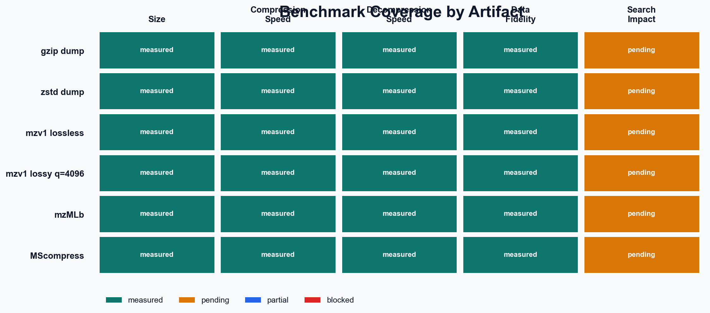

# Benchmark Report: 15HCD_1

- mzML input: data/PXD075509/15HCD_1.mzML
- private workdir: data/PXD075509/benchmarks/15HCD_1
- public output dir: benchmark
- repeats: 1
- selected lossy intensity quantization: q=4096

## Story

The flat dump is smaller than mzML because it strips almost all interchange overhead: XML structure, controlled-vocabulary markup, base64 wrapping, and general-purpose metadata that this prototype does not need for codec bring-up. That makes the dump a useful internal floor, not a format competitor by itself.

This benchmark focuses on two things that matter right now: whether the current `.mzv1` path buys meaningful size reduction over the interchange format, and whether encode and decode stay fast and stable across repeated runs.

## Coverage Overview

External formats that actually ran end-to-end in this benchmark: mzMLb, MScompress.

## Dataset

- spectra: 9001
- total peaks: 2668458
- ms1 spectra: 917
- ms2 spectra: 8084

## Size Comparison

| artifact | bytes | size | vs mzML | vs dump |
| --- | ---: | ---: | ---: | ---: |
| mzML | 79221306 | 75.55 MiB | 100.00% | 245.47% |
| dump | 32273524 | 30.78 MiB | 40.74% | 100.00% |
| mzv1 lossless | 20467802 | 19.52 MiB | 25.84% | 63.42% |
| mzv1 lossy | 13778826 | 13.14 MiB | 17.39% | 42.69% |
| gzip dump | 20780851 | 19.82 MiB | 26.23% | 64.39% |
| zstd dump | 18720327 | 17.85 MiB | 23.63% | 58.01% |
| mzMLb | 17038178 | 16.25 MiB | 21.51% | 52.79% |
| MScompress | 22679622 | 21.63 MiB | 28.63% | 70.27% |

Lossless `.mzv1` is already materially smaller than mzML on this sample, and it slightly beats `gzip` on the dump baseline while still trailing `zstd` on the dump. The selected lossy mode gives a controlled next step down in size without the catastrophic saturation behavior that the earlier intensity quantizer had.

## Performance Overview

| artifact | direction | status | throughput | mean time | throughput basis | source format | notes |
| --- | --- | --- | ---: | ---: | --- | --- | --- |
| gzip dump | compression | measured | 18.74 MiB/s | 1.6428s | input | dump |  |
| gzip dump | decompression | measured | 152.5 MiB/s | 0.20182s | output | gzip dump |  |
| zstd dump | compression | measured | 168.6 MiB/s | 0.18257s | input | dump |  |
| zstd dump | decompression | measured | 582.6 MiB/s | 0.052826s | output | zstd dump |  |
| mzv1 lossless | compression | measured | 40.04 MiB/s | 0.76867s | input | dump |  |
| mzv1 lossless | decompression | measured | 39.16 MiB/s | 0.78605s | output | mzv1 lossless |  |
| mzv1 lossy q=4096 | compression | measured | 26.3 MiB/s | 1.1705s | input | dump |  |
| mzv1 lossy q=4096 | decompression | measured | 35.54 MiB/s | 0.86601s | output | mzv1 lossy q=4096 |  |
| mzMLb | compression | measured | 3.135 MiB/s | 24.097s | input | mzML |  |
| mzMLb | decompression | measured | 6.304 MiB/s | 4.8825s | output | mzMLb |  |
| MScompress | compression | measured | 104.2 MiB/s | 0.72486s | input | mzML |  |
| MScompress | decompression | measured | 4.464 MiB/s | 6.8951s | output | MScompress |  |

## Timing Variability

The chart above uses all 1 runs per operation. Gray dots are individual runs. Black points show the mean with a two-sided 95% confidence interval for the mean.

| operation | mean ± sd | median | 95% CI of mean | min | max | throughput | basis |
| --- | ---: | ---: | ---: | ---: | ---: | ---: | --- |
| mzML -> dump | 4.6498s ± 0.0000s | 4.6498s | [4.6498s, 4.6498s] | 4.6498s | 4.6498s | 16.25 MiB/s | input |
| dump -> gzip dump | 1.6428s ± 0.0000s | 1.6428s | [1.6428s, 1.6428s] | 1.6428s | 1.6428s | 18.74 MiB/s | input |
| gzip dump -> dump | 0.2018s ± 0.0000s | 0.2018s | [0.2018s, 0.2018s] | 0.2018s | 0.2018s | 152.50 MiB/s | output |
| dump -> zstd dump | 0.1826s ± 0.0000s | 0.1826s | [0.1826s, 0.1826s] | 0.1826s | 0.1826s | 168.58 MiB/s | input |
| zstd dump -> dump | 0.0528s ± 0.0000s | 0.0528s | [0.0528s, 0.0528s] | 0.0528s | 0.0528s | 582.64 MiB/s | output |
| dump -> mzv1 lossless | 0.7687s ± 0.0000s | 0.7687s | [0.7687s, 0.7687s] | 0.7687s | 0.7687s | 40.04 MiB/s | input |
| mzv1 lossless -> dump | 0.7861s ± 0.0000s | 0.7861s | [0.7861s, 0.7861s] | 0.7861s | 0.7861s | 39.16 MiB/s | output |
| dump -> mzv1 lossy q=4096 | 1.1705s ± 0.0000s | 1.1705s | [1.1705s, 1.1705s] | 1.1705s | 1.1705s | 26.30 MiB/s | input |
| mzv1 lossy q=4096 -> dump | 0.8660s ± 0.0000s | 0.8660s | [0.8660s, 0.8660s] | 0.8660s | 0.8660s | 35.54 MiB/s | output |
| mzML -> mzMLb | 24.0969s ± 0.0000s | 24.0969s | [24.0969s, 24.0969s] | 24.0969s | 24.0969s | 3.14 MiB/s | input |
| mzMLb -> dump | 4.8825s ± 0.0000s | 4.8825s | [4.8825s, 4.8825s] | 4.8825s | 4.8825s | 6.30 MiB/s | output |
| mzML -> MScompress | 0.7249s ± 0.0000s | 0.7249s | [0.7249s, 0.7249s] | 0.7249s | 0.7249s | 104.23 MiB/s | input |
| MScompress -> dump | 6.8951s ± 0.0000s | 6.8951s | [6.8951s, 6.8951s] | 6.8951s | 6.8951s | 4.46 MiB/s | output |

## External Baselines

| baseline | status | size | encode | decode | notes |
| --- | --- | ---: | --- | --- | --- |
| mzMLb | benchmarked | 16.25 MiB | mzML -> mzMLb | mzMLb -> dump | Converted with psims MzMLToMzMLb using HDF5 compression `blosc:zstd`. |
| MScompress | benchmarked | 21.63 MiB | mzML -> MScompress | MScompress -> dump | Converted with the MScompress Python package using 1 thread for single-thread comparability. |

## Data Fidelity

| artifact | status | global order | max abs m/z | mean abs intensity | max abs intensity | p95 rel intensity | notes |
| --- | --- | ---: | ---: | ---: | ---: | ---: | --- |
| gzip dump | measured | true | 0 | 0 | 0 | 0.000% |  |
| zstd dump | measured | true | 0 | 0 | 0 | 0.000% |  |
| mzv1 lossless | measured | false | 1.00000011e-06 | 0 | 0 | 0.000% |  |
| mzv1 lossy q=4096 | measured | false | 1.00000011e-06 | 695.252613 | 3177472 | 0.218% |  |
| mzMLb | measured | true | 0 | 0 | 0 | 0.000% |  |
| MScompress | measured | true | 0 | 0 | 0 | 0.000% |  |

## Fidelity Summary

| artifact | global order | ms1 order | ms2 order | mean abs mz | max abs mz | mean abs intensity | rmse intensity | p95 rel intensity | p99 rel intensity | mean abs log1p intensity |
| --- | ---: | ---: | ---: | ---: | ---: | ---: | ---: | ---: | ---: | ---: |
| gzip dump | true | true | true | 0 | 0 | 0 | 0 | 0.000% | 0.000% | 0 |
| zstd dump | true | true | true | 0 | 0 | 0 | 0 | 0.000% | 0.000% | 0 |
| mzv1 lossless | false | true | true | 5.00068204e-07 | 1.00000011e-06 | 0 | 0 | 0.000% | 0.000% | 0 |
| mzv1 lossy q=4096 | false | true | true | 5.00068204e-07 | 1.00000011e-06 | 695.252613 | 10758.6615 | 0.218% | 0.238% | 0.00113669413 |
| mzMLb | true | true | true | 0 | 0 | 0 | 0 | 0.000% | 0.000% | 0 |
| MScompress | true | true | true | 0 | 0 | 0 | 0 | 0.000% | 0.000% | 0 |

On the current run, `gzip dump`, `zstd dump`, `mzMLb`, and `MScompress` round-trip exactly. `mzv1 lossless` is intensity-exact but still carries the expected fixed-point m/z quantization, and `mzv1 lossy` adds the configured intensity quantization on top of that. Global order is still not preserved for `mzv1` because MS1 and MS2 are written as separate streams.

## Lossy Sweep

| q | bytes | size | p95 rel intensity err | p99 rel intensity err | mean rel intensity err |
| ---: | ---: | ---: | ---: | ---: | ---: |
| 256 | 12444574 | 11.87 MiB | 3.499% | 3.813% | 1.820% |
| 1024 | 13111717 | 12.50 MiB | 0.874% | 0.950% | 0.455% |
| 4096 | 13778826 | 13.14 MiB | 0.218% | 0.238% | 0.114% |
| 16384 | 14445949 | 13.78 MiB | 0.055% | 0.059% | 0.028% |

The selected `q` stays user-controlled. Higher `q` means more preserved log-intensity precision and usually a larger file; lower `q` buys size at the cost of broader relative error tails.

## Search Impact

| artifact | status | peptide ID difference | peptide ID change | FDR change | notes |
| --- | --- | ---: | ---: | ---: | --- |
| gzip dump | not-measured | n/a | n/a | n/a | Requires downstream peptide identification and FDR measurements on the original and round-tripped spectra. Dump round-trip was numerically exact on the current comparison. |
| zstd dump | not-measured | n/a | n/a | n/a | Requires downstream peptide identification and FDR measurements on the original and round-tripped spectra. Dump round-trip was numerically exact on the current comparison. |
| mzv1 lossless | not-measured | n/a | n/a | n/a | Requires downstream peptide identification and FDR measurements on the original and round-tripped spectra. |
| mzv1 lossy q=4096 | not-measured | n/a | n/a | n/a | Requires downstream peptide identification and FDR measurements on the original and round-tripped spectra. |
| mzMLb | not-measured | n/a | n/a | n/a | Requires downstream peptide identification and FDR measurements on the original and round-tripped spectra. Dump round-trip was numerically exact on the current comparison. |
| MScompress | not-measured | n/a | n/a | n/a | Requires downstream peptide identification and FDR measurements on the original and round-tripped spectra. Dump round-trip was numerically exact on the current comparison. |

Search-impact metrics are not measured by the current benchmark pipeline yet. They remain listed here so the report does not imply numerical equivalence where no downstream search experiment has actually been run.

## How The Error Numbers Are Computed

The reported means are computed over every matched peak after round-trip decode. They are not inferred from min and max.

- Mean absolute error: average absolute per-peak error.
- RMSE: square root of the average squared per-peak error.
- Relative intensity error: absolute error divided by the original intensity, evaluated only on strictly positive peaks.
- log1p intensity error: absolute error after applying `log1p`, which keeps the metric useful across large dynamic range.

## Future Comparison Candidates

These are the remaining or still-blocked comparison candidates after the current benchmark run.

| candidate | core idea | why test it next | source |
| --- | --- | --- | --- |
| mspack | Dedicated mass-spectrometry compressor for mzML and mzXML with both lossless and lossy modes and explicit decode support. | It is a direct codec-style baseline rather than a general container baseline, so it is much closer to mzarc on design intent. | fhanau/mspack |
| MS-Numpress in mzML | Array-level compression inside the mzML ecosystem: linear prediction for smooth m/z arrays and logged or integer schemes for intensities. | It is the closest standard-adjacent baseline for testing whether mzarc beats established PSI-compatible spectrum array compression. | ms-numpress project |
| mz5 | Re-encodes the mzML ontology on top of HDF5, uses binary datasets, compression-friendly layout, and delta mass storage. | The published paper reports roughly 54% of mzML size and materially faster linear read and write, so it is a useful open-format systems baseline. | PMCID: PMC3270111 |
| Aird | A computation-oriented format designed around higher compression ratio and lower decoding time, with related StackZDPD work on fast spectral encoding. | It is a strong modern comparison point because its stated goals overlap almost exactly with mzarc: practical compression and decode speed for analysis workflows. | PMID: 35021987; PMID: 35354909 |
