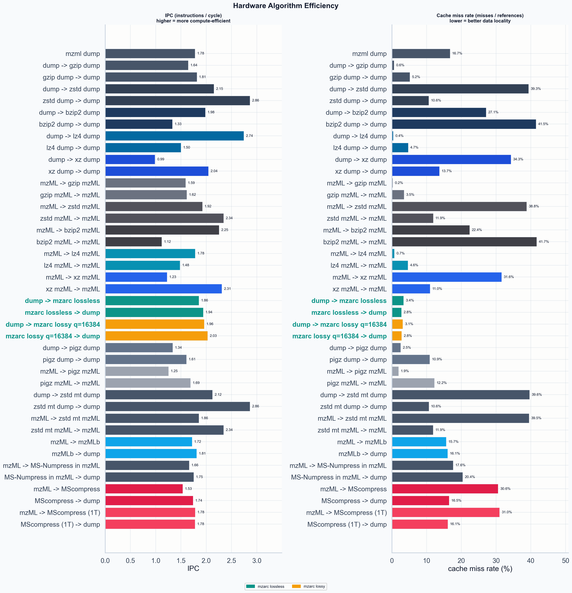

# Benchmark Report: 15HCD_1

**Dataset:** `data/PXD075509/15HCD_1.mzML`  |  9,001 spectra (917 MS1 / 8,084 MS2)  |  2,668,458 total peaks  |  lossy q=16384

mzarc is a domain-specific MS codec: it strips mzML interchange overhead and applies delta coding, frame-of-reference packing, and rANS entropy coding tuned to the statistical structure of m/z and intensity arrays. Three comparison groups are used: MS-domain codecs (mzarc, mzMLb, MScompress, MS-Numpress) that understand spectrum structure; generic compressors applied to the mzML XML interchange format; and generic compressors applied to the stripped binary dump (a lower-bound reference that is not a viable interchange format).

## Key Results

| codec | size | vs mzML | encode MiB/s | decode MiB/s | fidelity |
| --- | ---: | ---: | ---: | ---: | --- |
| mzarc lossless | 14.46 MiB | 19.1% | 56.81 | 169.8 | exact |
| mzarc lossy q=16384 | 12.66 MiB | 16.8% | 38.95 | 127 | lossy |
| mzMLb | 16.25 MiB | 21.5% | 0.6856 | 5.791 | exact |
| MScompress | 21.53 MiB | 28.5% | 75.47 | 5.63 | exact |
| MScompress (1T) | 21.63 MiB | 28.6% | 25.22 | 4.259 | exact |
| MS-Numpress in mzML | 66.67 MiB | 88.2% | 2.755 | 4.803 | lossy |

Best single-thread generic size on the binary dump: `xz dump` at 15.77 MiB (20.9% of mzML). mzarc lossless is 8.3% smaller.

External MS-domain codecs benchmarked in this run: mzMLb, MS-Numpress in mzML, MScompress, MScompress (1T).

## Size Comparison

| artifact | size | vs mzML | vs dump |
| --- | ---: | ---: | ---: |
| mzML | 75.55 MiB | 100.00% | 245.47% |
| dump | 30.78 MiB | 40.74% | 100.00% |
| gzip dump | 19.82 MiB | 26.23% | 64.39% |
| zstd dump | 17.85 MiB | 23.63% | 58.01% |
| bzip2 dump | 18.81 MiB | 24.89% | 61.10% |
| lz4 dump | 24.83 MiB | 32.87% | 80.68% |
| xz dump | 15.77 MiB | 20.87% | 51.24% |
| gzip mzML | 24.29 MiB | 32.14% | 78.90% |
| zstd mzML | 23.62 MiB | 31.27% | 76.75% |
| bzip2 mzML | 23.58 MiB | 31.20% | 76.60% |
| lz4 mzML | 33.21 MiB | 43.96% | 107.91% |
| xz mzML | 23.40 MiB | 30.97% | 76.03% |
| mzarc lossless | 14.46 MiB | 19.14% | 46.99% |
| mzarc lossy q=16384 | 12.66 MiB | 16.76% | 41.14% |
| pigz dump | 19.77 MiB | 26.17% | 64.24% |
| pigz mzML | 24.22 MiB | 32.06% | 78.69% |
| zstd mt dump | 17.85 MiB | 23.63% | 58.01% |
| zstd mt mzML | 23.62 MiB | 31.27% | 76.75% |
| mzMLb | 16.25 MiB | 21.51% | 52.79% |
| MS-Numpress in mzML | 66.67 MiB | 88.24% | 216.60% |
| MScompress | 21.53 MiB | 28.50% | 69.96% |
| MScompress (1T) | 21.63 MiB | 28.63% | 70.27% |

### Internal Byte Breakdown

| artifact | structural | spectrum metadata | m/z stream | intensity stream | total |
| --- | ---: | ---: | ---: | ---: | ---: |
| mzarc lossless | 0.04 MiB (0.3%) | 0.15 MiB (1.1%) | 6.00 MiB (41.5%) | 8.27 MiB (57.2%) | 14.46 MiB |
| mzarc lossy q=16384 | 0.04 MiB (0.3%) | 0.15 MiB (1.2%) | 8.04 MiB (63.5%) | 4.44 MiB (35.0%) | 12.66 MiB |

## Throughput

| artifact | category | direction | throughput | median | n |
| --- | --- | --- | ---: | ---: | ---: |
| gzip dump | Generic (on dump) | compression | 11.99 MiB/s | 1.653s | 10 |
| gzip dump | Generic (on dump) | decompression | 140.1 MiB/s | 0.2197s | 23 |
| zstd dump | Generic (on dump) | compression | 92.86 MiB/s | 0.1923s | 16 |
| zstd dump | Generic (on dump) | decompression | 478.7 MiB/s | 0.06429s | 46 |
| bzip2 dump | Generic (on dump) | compression | 7.075 MiB/s | 2.658s | 3 |
| bzip2 dump | Generic (on dump) | decompression | 20.69 MiB/s | 1.487s | 3 |
| lz4 dump | Generic (on dump) | compression | 294.8 MiB/s | 0.08425s | 36 |
| lz4 dump | Generic (on dump) | decompression | 452.9 MiB/s | 0.06797s | 44 |
| xz dump | Generic (on dump) | compression | 1.374 MiB/s | 11.48s | 3 |
| xz dump | Generic (on dump) | decompression | 60.09 MiB/s | 0.5122s | 6 |
| gzip mzML | Generic (on mzML) | compression | 15.85 MiB/s | 1.533s | 3 |
| gzip mzML | Generic (on mzML) | decompression | 202.5 MiB/s | 0.373s | 9 |
| zstd mzML | Generic (on mzML) | compression | 136.9 MiB/s | 0.1726s | 18 |
| zstd mzML | Generic (on mzML) | decompression | 965 MiB/s | 0.07829s | 39 |
| bzip2 mzML | Generic (on mzML) | compression | 3.422 MiB/s | 6.889s | 3 |
| bzip2 mzML | Generic (on mzML) | decompression | 30.3 MiB/s | 2.494s | 3 |
| lz4 mzML | Generic (on mzML) | compression | 313.7 MiB/s | 0.1059s | 29 |
| lz4 mzML | Generic (on mzML) | decompression | 684.6 MiB/s | 0.1104s | 28 |
| xz mzML | Generic (on mzML) | compression | 4.431 MiB/s | 5.282s | 3 |
| xz mzML | Generic (on mzML) | decompression | 194.6 MiB/s | 0.3882s | 8 |
| mzarc lossless | MS-domain codec | compression | 56.81 MiB/s | 0.2546s | 118 |
| mzarc lossless | MS-domain codec | decompression | 169.8 MiB/s | 0.1813s | 165 |
| mzarc lossy q=16384 | MS-domain codec | compression | 38.95 MiB/s | 0.3251s | 92 |
| mzarc lossy q=16384 | MS-domain codec | decompression | 127 MiB/s | 0.2424s | 124 |
| pigz dump | Parallel (multi-thread) | compression | 232.2 MiB/s | 0.08516s | 36 |
| pigz dump | Parallel (multi-thread) | decompression | 242.7 MiB/s | 0.1268s | 24 |
| pigz mzML | Parallel (multi-thread) | compression | 234.9 MiB/s | 0.1031s | 29 |
| pigz mzML | Parallel (multi-thread) | decompression | 428.8 MiB/s | 0.1762s | 18 |
| zstd mt dump | Parallel (multi-thread) | compression | 234.2 MiB/s | 0.07623s | 39 |
| zstd mt dump | Parallel (multi-thread) | decompression | 481.9 MiB/s | 0.06387s | 47 |
| zstd mt mzML | Parallel (multi-thread) | compression | 302.2 MiB/s | 0.07818s | 39 |
| zstd mt mzML | Parallel (multi-thread) | decompression | 842.1 MiB/s | 0.08972s | 31 |
| mzMLb | MS-domain codec | compression | 0.6856 MiB/s | 23.7s | 3 |
| mzMLb | MS-domain codec | decompression | 5.791 MiB/s | 5.315s | 3 |
| MS-Numpress in mzML | MS-domain codec | compression | 2.755 MiB/s | 24.2s | 3 |
| MS-Numpress in mzML | MS-domain codec | decompression | 4.803 MiB/s | 6.408s | 3 |
| MScompress | MS-domain codec | compression | 75.47 MiB/s | 0.2853s | 11 |
| MScompress | MS-domain codec | decompression | 5.63 MiB/s | 5.467s | 3 |
| MScompress (1T) | MS-domain codec | compression | 25.22 MiB/s | 0.8575s | 4 |
| MScompress (1T) | MS-domain codec | decompression | 4.259 MiB/s | 7.226s | 3 |

## Memory and CPU

All values are zebrac medians from Linux perf counters. IPC = instructions / cycle (higher = more compute-efficient). Cache miss rate = cache_misses / cache_references (lower = better data locality).

| operation | wall time | peak RSS | instructions | IPC | cache miss rate | n |
| --- | ---: | ---: | ---: | ---: | ---: | ---: |
| mzml dump | 4.993s | 76.8 MiB | 3.18e+10 | 1.78 | 16.733% | 5 |
| dump -> gzip dump | 1.653s | 1.9 MiB | 9.86e+09 | 1.64 | 0.621% | 10 |
| gzip dump -> dump | 0.2197s | 1.6 MiB | 1.26e+09 | 1.81 | 5.160% | 23 |
| dump -> zstd dump | 0.1923s | 45.2 MiB | 1.35e+09 | 2.15 | 39.343% | 16 |
| zstd dump -> dump | 0.06429s | 6.4 MiB | 5.22e+08 | 2.86 | 10.619% | 46 |
| dump -> bzip2 dump | 2.658s | 7.6 MiB | 1.91e+10 | 1.98 | 27.126% | 3 |
| bzip2 dump -> dump | 1.487s | 4.9 MiB | 6.85e+09 | 1.33 | 41.506% | 3 |
| dump -> lz4 dump | 0.08425s | 8.6 MiB | 5.96e+08 | 2.74 | 0.366% | 36 |
| lz4 dump -> dump | 0.06797s | 8.6 MiB | 1.8e+08 | 1.5 | 4.694% | 44 |
| dump -> xz dump | 11.48s | 218.5 MiB | 5.08e+10 | 0.986 | 34.277% | 3 |
| xz dump -> dump | 0.5122s | 59.8 MiB | 4.5e+09 | 2.04 | 13.705% | 6 |
| mzML -> gzip mzML | 1.533s | 1.9 MiB | 8.83e+09 | 1.59 | 0.222% | 3 |
| gzip mzML -> mzML | 0.373s | 1.6 MiB | 1.89e+09 | 1.62 | 3.496% | 9 |
| mzML -> zstd mzML | 0.1726s | 42.9 MiB | 1.15e+09 | 1.92 | 38.789% | 18 |
| zstd mzML -> mzML | 0.07829s | 6.4 MiB | 4.67e+08 | 2.34 | 11.893% | 39 |
| mzML -> bzip2 mzML | 6.889s | 7.6 MiB | 5.65e+10 | 2.25 | 22.376% | 3 |
| bzip2 mzML -> mzML | 2.494s | 4.9 MiB | 9.49e+09 | 1.12 | 41.691% | 3 |
| mzML -> lz4 mzML | 0.1059s | 7.8 MiB | 4.93e+08 | 1.78 | 0.694% | 29 |
| lz4 mzML -> mzML | 0.1104s | 8.1 MiB | 2.27e+08 | 1.48 | 4.619% | 28 |
| mzML -> xz mzML | 5.282s | 426.7 MiB | 6.27e+10 | 1.23 | 31.589% | 3 |
| xz mzML -> mzML | 0.3882s | 117.0 MiB | 7.2e+09 | 2.31 | 10.998% | 8 |
| dump -> mzarc lossless | 0.2546s | 85.7 MiB | 1.14e+09 | 1.86 | 3.376% | 118 |
| mzarc lossless -> dump | 0.1813s | 78.7 MiB | 7.99e+08 | 1.94 | 2.753% | 165 |
| dump -> mzarc lossy q=16384 | 0.3251s | 80.4 MiB | 1.74e+09 | 1.96 | 3.136% | 92 |
| mzarc lossy q=16384 -> dump | 0.2424s | 76.9 MiB | 1.27e+09 | 2.03 | 2.816% | 124 |
| dump -> pigz dump | 0.08516s | 20.4 MiB | 9.49e+09 | 1.34 | 2.506% | 36 |
| pigz dump -> dump | 0.1268s | 1.9 MiB | 8.13e+08 | 1.61 | 10.897% | 24 |
| mzML -> pigz mzML | 0.1031s | 19.6 MiB | 8.36e+09 | 1.25 | 1.931% | 29 |
| pigz mzML -> mzML | 0.1762s | 1.9 MiB | 1.3e+09 | 1.69 | 12.246% | 18 |
| dump -> zstd mt dump | 0.07623s | 57.0 MiB | 1.35e+09 | 2.12 | 39.629% | 39 |
| zstd mt dump -> dump | 0.06387s | 6.4 MiB | 5.22e+08 | 2.86 | 10.639% | 47 |
| mzML -> zstd mt mzML | 0.07818s | 98.2 MiB | 1.15e+09 | 1.86 | 39.504% | 39 |
| zstd mt mzML -> mzML | 0.08972s | 6.4 MiB | 4.67e+08 | 2.34 | 11.877% | 31 |
| mzML -> mzMLb | 23.7s | 335.5 MiB | 1.41e+11 | 1.72 | 15.653% | 3 |
| mzMLb -> dump | 5.315s | 182.1 MiB | 3.39e+10 | 1.81 | 16.074% | 3 |
| mzML -> MS-Numpress in mzML | 24.2s | 152.8 MiB | 1.37e+11 | 1.66 | 17.625% | 3 |
| MS-Numpress in mzML -> dump | 6.408s | 114.9 MiB | 3.98e+10 | 1.75 | 20.371% | 3 |
| mzML -> MScompress | 0.2853s | 359.8 MiB | 4.91e+09 | 1.53 | 30.588% | 11 |
| MScompress -> dump | 5.467s | 302.3 MiB | 4.55e+10 | 1.74 | 16.485% | 3 |
| mzML -> MScompress (1T) | 0.8575s | 290.1 MiB | 4.89e+09 | 1.78 | 30.999% | 4 |
| MScompress (1T) -> dump | 7.226s | 282.1 MiB | 4.55e+10 | 1.78 | 16.096% | 3 |

## Statistical Comparisons

Mann-Whitney U tests on log-normal samples drawn from zebrac summary statistics. Speed ratio = mzarc time / baseline time; ratio < 1 means mzarc is faster. p < 0.05 is significant.

| operation A | operation B | speed ratio | p-value | significant |
| --- | --- | ---: | ---: | --- |
| dump -> mzarc lossless | dump -> gzip dump | 0.155 | 1.657e-07 | yes |
| dump -> mzarc lossless | dump -> zstd dump | 1.34 | 9.542e-11 | yes |

## Data Fidelity

| artifact | exact | global order | max ppm m/z | p95 rel intensity | p99 rel intensity |
| --- | --- | --- | ---: | ---: | ---: |
| mzarc lossless | yes | true | 0 | 0.000% | 0.000% |
| mzarc lossy q=16384 | no | true | 0.0074601 | 0.055% | 0.059% |
| mzMLb | yes | true | 0 | 0.000% | 0.000% |
| MScompress | yes | true | 0 | 0.000% | 0.000% |
| MScompress (1T) | yes | true | 0 | 0.000% | 0.000% |
| MS-Numpress in mzML | no | true | 0.0014035 | 0.012% | 0.014% |
| gzip dump | yes | true | 0 | 0.000% | 0.000% |
| zstd dump | yes | true | 0 | 0.000% | 0.000% |
| bzip2 dump | yes | true | 0 | 0.000% | 0.000% |
| lz4 dump | yes | true | 0 | 0.000% | 0.000% |
| xz dump | yes | true | 0 | 0.000% | 0.000% |
| pigz dump | yes | true | 0 | 0.000% | 0.000% |
| zstd mt dump | yes | true | 0 | 0.000% | 0.000% |

`mzarc lossless`, `mzMLb`, `MScompress`, `MScompress (1T)`, `gzip dump`, `zstd dump`, `bzip2 dump`, `lz4 dump`, `xz dump`, `pigz dump` and `zstd mt dump` round-trip exactly. `mzarc lossless` is numerically exact and preserves global scan order. `mzarc lossy` preserves scan order; p95 relative intensity error is 0.055%.

## Lossy Quantization Sweep

| q | size | vs mzML | p95 rel intensity err | p99 rel intensity err | mean |
| ---: | ---: | ---: | ---: | ---: | ---: |
| 256 | 10.22 MiB | 13.5% | 3.499% | 3.813% | 1.820% |
| 1024 | 11.35 MiB | 15.0% | 0.874% | 0.950% | 0.455% |
| 4096 | 11.98 MiB | 15.9% | 0.218% | 0.238% | 0.114% |
| 16384 | 12.66 MiB | 16.8% | 0.055% | 0.059% | 0.028% |

Higher q = more preserved log-intensity precision at the cost of a larger file. Selected q=16384 gives p95 relative intensity error of 0.055%. Relative error = abs(delta) / original, evaluated over strictly positive peaks after round-trip decode.

