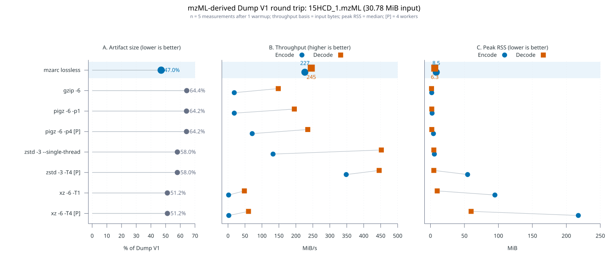
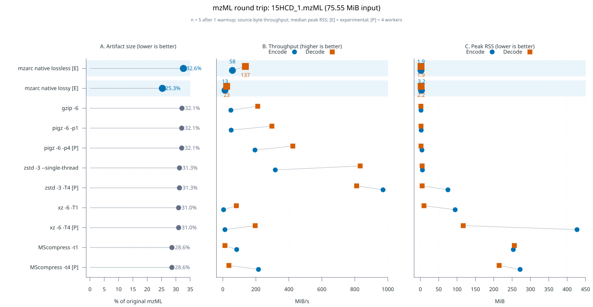

<!-- markdownlint-disable MD024 -->

# Reference compression benchmark

This report compares lossless compression of one mzML-derived Dump V1 input and the original mzML document. Compare methods only within the same input section because the inputs and validation contracts differ.

## Key findings

- mzarc produces a 14.46 MiB artifact from the Dump V1 input (46.99% of input), 8.23% smaller than the next-smallest single-threaded byte-exact row, xz `-6 -T1`.
- mzarc is the fastest single-threaded Dump V1 encoder at 206.22 MiB/s. The fixed-4 zstd row leads overall encode at 387.52 MiB/s. zstd records 459.46 MiB/s decode for the single-thread artifact and 463.54 MiB/s for the fixed-4 artifact; both decode operations are single-threaded.
- mzarc peak RSS is 10.58 MiB for encode and 6.45 MiB for decode on this file. gzip records the lowest values in the Dump V1 table at 1.85 MiB and 1.60 MiB.
- On original mzML, MScompress `-t4` writes the smallest artifact at 28.62% but is validated as Dump V1 exact. xz `-6 -T1` is the smallest document-byte-exact row at 30.96%. The fixed-4 zstd row records 1024.64 MiB/s encode; its single-threaded decode records 844.94 MiB/s.

## Run context

- Source: `data/PXD075509/15HCD_1.mzML`
- Source shape: 9,001 spectra; 2,668,458 peaks; 917 MS1 and 8,084 MS2 spectra
- Measured: 2026-08-11T19:35:13-07:00
- Host: AMD Ryzen 9 3950X 16-Core Processor; Linux 7.0.11-76070011-generic x86_64 GNU/Linux
- mzarc build: stripped ReleaseFast, single-threaded
- Sampling: 5 measurements per operation after one warmup
- Parallel rows: 4 workers, marked `[P]`; direction-specific behavior remains in the tables
- Execution: each operation is measured independently; files are reused after untimed validation and one warmup
- Throughput: uncompressed input bytes divided by mean wall time
- Peak RSS: median zebrac direct-child RSS

## Input size context

| Representation          |    Bytes |   MiB | Representation / original mzML |
| ----------------------- | -------: | ----: | -----------------------------: |
| Original mzML           | 79221306 | 75.55 |                        100.00% |
| Dump V1 retained fields | 32273524 | 30.78 |                         40.74% |
| mzarc lossless          | 15164187 | 14.46 |                         19.14% |

The mzarc percentage against original mzML describes the current mzML-to-Dump-V1-to-mzarc storage path. mzarc reads Dump V1 and does not reproduce the original mzML document.

## Dump V1 round trip

Comparison input: Dump V1, 30.78 MiB (32273524 bytes).

### Artifact

| Method                  | Threads (encode / decode) | Validation | Artifact bytes | Artifact / Dump V1 |
| ----------------------- | ------------------------- | ---------- | -------------: | -----------------: |
| mzarc lossless          | single / single           | byte exact |       15164187 |             46.99% |
| gzip -6                 | single / single           | byte exact |       20780851 |             64.39% |
| pigz -6 -p1             | single / single           | byte exact |       20731776 |             64.24% |
| pigz -6 -p4 [P]         | fixed-4 / fixed-4 helpers | byte exact |       20731776 |             64.24% |
| zstd -3 --single-thread | single / single           | byte exact |       18721502 |             58.01% |
| zstd -3 -T4 [P]         | fixed-4 / single          | byte exact |       18720327 |             58.01% |
| xz -6 -T1               | single / single           | byte exact |       16524524 |             51.20% |
| xz -6 -T4 [P]           | fixed-4 / fixed-4         | byte exact |       16535444 |             51.24% |

### Encode

| Method                  |      Mean ± SD (ms) |  MiB/s | Peak RSS (MiB) |
| ----------------------- | ------------------: | -----: | -------------: |
| mzarc lossless          |     149.250 ± 2.800 | 206.22 |          10.58 |
| gzip -6                 |    1640.256 ± 3.514 |  18.76 |           1.85 |
| pigz -6 -p1             |    1646.129 ± 4.927 |  18.70 |           2.38 |
| pigz -6 -p4 [P]         |     422.022 ± 1.683 |  72.93 |           4.39 |
| zstd -3 --single-thread |     222.910 ± 2.427 | 138.08 |           5.72 |
| zstd -3 -T4 [P]         |      79.425 ± 5.287 | 387.52 |          54.70 |
| xz -6 -T1               | 15703.412 ± 105.242 |   1.96 |          94.40 |
| xz -6 -T4 [P]           | 12287.174 ± 241.684 |   2.50 |         218.17 |

### Decode

| Method                  |  Mean ± SD (ms) |  MiB/s | Peak RSS (MiB) |
| ----------------------- | --------------: | -----: | -------------: |
| mzarc lossless          | 130.060 ± 4.505 | 236.65 |           6.45 |
| gzip -6                 | 202.963 ± 0.311 | 151.65 |           1.60 |
| pigz -6 -p1             | 155.713 ± 1.615 | 197.66 |           1.91 |
| pigz -6 -p4 [P]         | 122.825 ± 1.878 | 250.59 |           1.87 |
| zstd -3 --single-thread |  66.988 ± 0.656 | 459.46 |           4.97 |
| zstd -3 -T4 [P]         |  66.399 ± 0.499 | 463.54 |           4.95 |
| xz -6 -T1               | 636.728 ± 7.647 |  48.34 |           9.92 |
| xz -6 -T4 [P]           | 502.994 ± 7.466 |  61.19 |          59.59 |

## Original mzML round trip

Comparison input: original mzML, 75.55 MiB (79221306 bytes).

### Artifact

| Method                  | Threads (encode / decode) | Validation    | Artifact bytes | Artifact / original mzML |
| ----------------------- | ------------------------- | ------------- | -------------: | -----------------------: |
| gzip -6                 | single / single           | byte exact    |       25465391 |                   32.14% |
| pigz -6 -p1             | single / single           | byte exact    |       25395942 |                   32.06% |
| pigz -6 -p4 [P]         | fixed-4 / fixed-4 helpers | byte exact    |       25395942 |                   32.06% |
| zstd -3 --single-thread | single / single           | byte exact    |       24771413 |                   31.27% |
| zstd -3 -T4 [P]         | fixed-4 / single          | byte exact    |       24770559 |                   31.27% |
| xz -6 -T1               | single / single           | byte exact    |       24527740 |                   30.96% |
| xz -6 -T4 [P]           | fixed-4 / fixed-4         | byte exact    |       24536980 |                   30.97% |
| MScompress -t1          | single / single           | Dump V1 exact |       22679622 |                   28.63% |
| MScompress -t4 [P]      | fixed-4 / fixed-4         | Dump V1 exact |       22670580 |                   28.62% |

### Encode

| Method                  |      Mean ± SD (ms) |   MiB/s | Peak RSS (MiB) |
| ----------------------- | ------------------: | ------: | -------------: |
| gzip -6                 |    1529.579 ± 8.433 |   49.39 |           1.85 |
| pigz -6 -p1             |   1476.117 ± 12.129 |   51.18 |           2.41 |
| pigz -6 -p4 [P]         |     383.171 ± 4.239 |  197.17 |           4.39 |
| zstd -3 --single-thread |     220.776 ± 4.208 |  342.21 |           5.68 |
| zstd -3 -T4 [P]         |      73.735 ± 2.393 | 1024.64 |          75.18 |
| xz -6 -T1               | 14767.819 ± 273.630 |    5.12 |          94.89 |
| xz -6 -T4 [P]           |   5608.520 ± 93.216 |   13.47 |         426.93 |
| MScompress -t1          |     888.144 ± 7.370 |   85.07 |         253.42 |
| MScompress -t4 [P]      |     349.347 ± 2.493 |  216.26 |         271.66 |

### Decode

| Method                  |    Mean ± SD (ms) |  MiB/s | Peak RSS (MiB) |
| ----------------------- | ----------------: | -----: | -------------: |
| gzip -6                 |   356.553 ± 4.833 | 211.89 |           1.60 |
| pigz -6 -p1             |   251.054 ± 4.287 | 300.94 |           1.90 |
| pigz -6 -p4 [P]         |   173.207 ± 3.760 | 436.19 |           1.90 |
| zstd -3 --single-thread |    90.639 ± 1.947 | 833.54 |           4.98 |
| zstd -3 -T4 [P]         |    89.417 ± 3.078 | 844.94 |           4.95 |
| xz -6 -T1               |   914.888 ± 7.284 |  82.58 |           9.93 |
| xz -6 -T4 [P]           |   377.591 ± 2.860 | 200.09 |         117.02 |
| MScompress -t1          | 5737.119 ± 38.062 |  13.17 |         255.59 |
| MScompress -t4 [P]      | 2028.739 ± 22.972 |  37.24 |         214.98 |

## Validation boundaries

- mzarc, gzip, pigz, zstd, and xz reproduce their Dump V1 input byte for byte.
- gzip, pigz, zstd, and xz reproduce the original mzML document byte for byte.
- MScompress reproduces the fields retained by Dump V1 here, not necessarily the original document bytes. Its decoded mzML is converted through the same Dump V1 converter and compared byte for byte with the source dump.

## Limits

- This report covers one file and one acquisition shape. It does not establish performance or RSS behavior across the broader corpus.
- mzarc currently starts from Dump V1. The original mzML section therefore has no mzarc row.
- The runner does not clear filesystem caches, randomize operation order, isolate CPUs, or control system load and CPU frequency.
- Wall time and RSS are measurements from one host, not portable guarantees.

## Tool versions

- mzarc: `v0.2.5`
- Build: Zig `0.16.0`; stripped ReleaseFast; single-threaded
- Ingest: Python `3.12.13`; Pyteomics `5.0.1`
- Measurement: `zebrac 0.6.2`
- Compression peers: `gzip 1.10`; `pigz 2.6`; `zstd 1.5.6`; `xz 5.6.4`; `MScompress 1.0.16`
- Report generation: `jq-1.6`; `gnuplot 5.4 patchlevel 2`

## Machine-readable rows

The full-precision Dump V1 rows are retained in [dump.tsv](dump.tsv) for direct local comparisons. The reader-facing tables above are rounded.

Column order: method, thread class, validation, artifact bytes, artifact percentage, encode mean ms, encode SD ms, encode MiB/s, encode RSS MiB, decode mean ms, decode SD ms, decode MiB/s, and decode RSS MiB.
