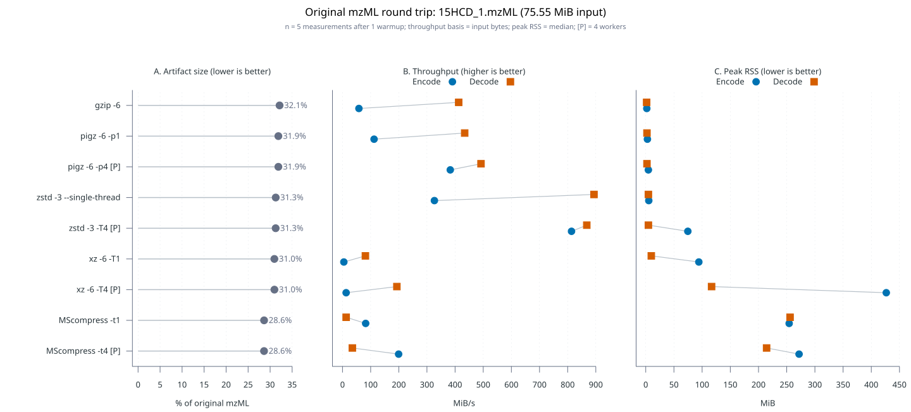

<!-- markdownlint-disable MD024 -->

# Reference compression benchmark

This report measures one mzML file three ways: lossless compression of its Dump V1 spectra, lossless compression of the original document, and the mzarc lossy profiles. Compare methods only within one section, because the inputs and validation contracts differ.

## Key findings

- **Dump V1:** `mzarc lossless` writes 14.46 MiB (46.99% of the input), 8.22% smaller than the smallest byte-exact peer, `xz -6 -T1` (15.76 MiB).
  Encode: 230.06 MiB/s, rank 2 of 8 rows; the fastest single-threaded peer is `zstd -3 --single-thread` at 131.49 MiB/s and the fastest peer overall is `zstd -3 -T4 [P]` at 373.69 MiB/s. Decode: 161.65 MiB/s, rank 6 of 8; the fastest is `zstd -3 --single-thread` at 441.85 MiB/s. Peak RSS: 8.98 MiB encode and 6.79 MiB decode; the lowest peers are `gzip -6` (1.90 MiB) and `gzip -6` (1.66 MiB).
- **Original mzML:** `mzarc exact` writes 24.00 MiB (31.77% of the input), 2.62% larger than the smallest byte-exact peer, `xz -6 -T1` (23.39 MiB). `MScompress -t4 [P]` writes 21.62 MiB but is validated as Dump V1 exact.
  Encode: 111.08 MiB/s, rank 6 of 10 rows; the fastest single-threaded peer is `zstd -3 --single-thread` at 329.26 MiB/s and the fastest peer overall is `zstd -3 -T4 [P]` at 874.18 MiB/s. Decode: 501.07 MiB/s, rank 3 of 10; the fastest is `zstd -3 --single-thread` at 897.31 MiB/s. Peak RSS: 1.30 MiB encode and 1.00 MiB decode; the lowest peers are `gzip -6` (1.86 MiB) and `gzip -6` (1.62 MiB).
- **Lossy:** the mzML lossy archive is 20.10% of the original document, 36.75% smaller than the exact archive; the Dump V1 lossy archive is 41.14% of its input, 12.45% smaller than the lossless archive. Largest observed errors: m/z 0.000000000000 Da and log1p intensity 0.000642643 (mzML), m/z 0.000001000000 Da and log1p intensity 0.000644625 (Dump V1), against a format-wide log1p limit of 0.005415332.

## Run context

- Source: `<data root>/PXD075509/15HCD_1.mzML`
- Source shape: 9001 spectra; 2668458 peaks; 917 MS1 and 8084 MS2 spectra
- Measured: 2026-10-10T12:18:21-07:00
- Host: AMD Ryzen 9 3950X 16-Core Processor; Linux 7.2.8-200.fc44.x86_64 x86_64 GNU/Linux
- CPU frequency governor: schedutil
- Load average (1, 5, 15 min): 4.51 5.17 4.86 before the build, 9.29 6.34 5.28 after the last measurement
- mzarc build: stripped ReleaseFast, single-threaded
- Sampling: 5 measurements per operation after one warmup
- Parallel rows: 4 workers, marked `[P]`; direction-specific behavior remains in the tables
- Execution: each operation is measured independently; files are reused after untimed validation and one warmup
- Timing: median wall time with its interquartile range (IQR); throughput is uncompressed input bytes divided by the median
- Peak RSS: median zebrac direct-child RSS
- Spread: 7 of 40 operations have an IQR above 5% of their median (largest: `zstd -3 -T4 [P]` encode 17.7%, `xz -6 -T4 [P]` encode 14.8%, `pigz -6 -p4 [P]` encode 11.2%); compare those timings only after a repeat run

## Input size context

| Representation                      |    Bytes |   MiB | Representation / original mzML |
| ----------------------------------- | -------: | ----: | -----------------------------: |
| Original mzML                       | 79221306 | 75.55 |                        100.00% |
| mzarc exact archive of the document | 25170444 | 24.00 |                         31.77% |
| mzarc lossy archive of the document | 15921538 | 15.18 |                         20.10% |
| Dump V1 retained fields             | 32273524 | 30.78 |                         40.74% |
| mzarc lossless archive of Dump V1   | 15165670 | 14.46 |                         19.14% |
| mzarc lossy archive of Dump V1      | 13277057 | 12.66 |                         16.76% |

The document archives restore the whole mzML file: exactly, or with only spectrum m/z and intensity values changed within their bounds. The Dump V1 archives restore only the spectrum fields Dump V1 keeps.

## mzML ingest

Converting the original mzML to Dump V1 with `mzarc dump`. Its output is checked byte for byte against the dump every Dump V1 row starts from.

| Step         | Output bytes | Median (ms) | IQR (ms) | mzML MiB/s | Peak RSS (MiB) |
| ------------ | -----------: | ----------: | -------: | ---------: | -------------: |
| `mzarc dump` |     32273524 |     440.170 |    7.848 |     171.64 |           1.25 |

## Dump V1 round trip

Comparison input: Dump V1, 30.78 MiB (32273524 bytes).

### Artifact

| Method                  | Threads (encode / decode) | Validation | Artifact bytes | Artifact / Dump V1 |
| ----------------------- | ------------------------- | ---------- | -------------: | -----------------: |
| mzarc lossless          | single / single           | byte exact |       15165670 |             46.99% |
| gzip -6                 | single / single           | byte exact |       20780851 |             64.39% |
| pigz -6 -p1             | single / single           | byte exact |       20707631 |             64.16% |
| pigz -6 -p4 [P]         | fixed-4 / fixed-4 helpers | byte exact |       20707625 |             64.16% |
| zstd -3 --single-thread | single / single           | byte exact |       18710563 |             57.97% |
| zstd -3 -T4 [P]         | fixed-4 / single          | byte exact |       18659882 |             57.82% |
| xz -6 -T1               | single / single           | byte exact |       16524524 |             51.20% |
| xz -6 -T4 [P]           | fixed-4 / fixed-4         | byte exact |       16535444 |             51.24% |

### Encode

| Method                  | Median (ms) | IQR (ms) | IQR / median |  MiB/s | Peak RSS (MiB) |
| ----------------------- | ----------: | -------: | -----------: | -----: | -------------: |
| mzarc lossless          |     133.786 |    1.918 |         1.4% | 230.06 |           8.98 |
| gzip -6                 |    1581.670 |   17.546 |         1.1% |  19.46 |           1.90 |
| pigz -6 -p1             |    1337.952 |    6.722 |         0.5% |  23.00 |           2.90 |
| pigz -6 -p4 [P]         |     349.361 |    9.732 |         2.8% |  88.10 |           4.92 |
| zstd -3 --single-thread |     234.065 |    4.069 |         1.7% | 131.49 |           5.64 |
| zstd -3 -T4 [P]         |      82.364 |   14.601 |        17.7% | 373.69 |          54.14 |
| xz -6 -T1               |   16744.339 |  925.039 |         5.5% |   1.84 |          93.91 |
| xz -6 -T4 [P]           |   12824.923 |  750.892 |         5.9% |   2.40 |         218.42 |

### Decode

| Method                  | Median (ms) | IQR (ms) | IQR / median |  MiB/s | Peak RSS (MiB) |
| ----------------------- | ----------: | -------: | -----------: | -----: | -------------: |
| mzarc lossless          |     190.404 |    8.855 |         4.7% | 161.65 |           6.79 |
| gzip -6                 |     138.172 |    1.856 |         1.3% | 222.75 |           1.66 |
| pigz -6 -p1             |     138.891 |    4.043 |         2.9% | 221.60 |           2.16 |
| pigz -6 -p4 [P]         |     130.834 |    4.927 |         3.8% | 235.25 |           2.16 |
| zstd -3 --single-thread |      69.659 |    1.306 |         1.9% | 441.85 |           4.64 |
| zstd -3 -T4 [P]         |      72.032 |    1.221 |         1.7% | 427.29 |           4.64 |
| xz -6 -T1               |     639.443 |   17.774 |         2.8% |  48.13 |          10.09 |
| xz -6 -T4 [P]           |     508.895 |   11.449 |         2.2% |  60.48 |          59.34 |

## Original mzML round trip

Comparison input: original mzML, 75.55 MiB (79221306 bytes).

### Artifact

| Method                  | Threads (encode / decode) | Validation    | Artifact bytes | Artifact / original mzML |
| ----------------------- | ------------------------- | ------------- | -------------: | -----------------------: |
| mzarc exact             | single / single           | byte exact    |       25170444 |                   31.77% |
| gzip -6                 | single / single           | byte exact    |       25465391 |                   32.14% |
| pigz -6 -p1             | single / single           | byte exact    |       25247634 |                   31.87% |
| pigz -6 -p4 [P]         | fixed-4 / fixed-4 helpers | byte exact    |       25247634 |                   31.87% |
| zstd -3 --single-thread | single / single           | byte exact    |       24773401 |                   31.27% |
| zstd -3 -T4 [P]         | fixed-4 / single          | byte exact    |       24761059 |                   31.26% |
| xz -6 -T1               | single / single           | byte exact    |       24527740 |                   30.96% |
| xz -6 -T4 [P]           | fixed-4 / fixed-4         | byte exact    |       24536980 |                   30.97% |
| MScompress -t1          | single / single           | Dump V1 exact |       22679622 |                   28.63% |
| MScompress -t4 [P]      | fixed-4 / fixed-4         | Dump V1 exact |       22670580 |                   28.62% |

### Encode

| Method                  | Median (ms) | IQR (ms) | IQR / median |  MiB/s | Peak RSS (MiB) |
| ----------------------- | ----------: | -------: | -----------: | -----: | -------------: |
| mzarc exact             |     680.147 |   20.658 |         3.0% | 111.08 |           1.30 |
| gzip -6                 |    1286.978 |   19.483 |         1.5% |  58.70 |           1.86 |
| pigz -6 -p1             |     667.297 |   11.066 |         1.7% | 113.22 |           2.85 |
| pigz -6 -p4 [P]         |     184.518 |   20.684 |        11.2% | 409.45 |           4.67 |
| zstd -3 --single-thread |     229.461 |    2.057 |         0.9% | 329.26 |           5.39 |
| zstd -3 -T4 [P]         |      86.426 |    8.232 |         9.5% | 874.18 |          74.64 |
| xz -6 -T1               |   15512.595 |  670.148 |         4.3% |   4.87 |          94.35 |
| xz -6 -T4 [P]           |    6078.825 |  901.505 |        14.8% |  12.43 |         426.67 |
| MScompress -t1          |     924.930 |   25.398 |         2.7% |  81.68 |         254.03 |
| MScompress -t4 [P]      |     374.692 |    6.763 |         1.8% | 201.64 |         271.46 |

### Decode

| Method                  | Median (ms) | IQR (ms) | IQR / median |  MiB/s | Peak RSS (MiB) |
| ----------------------- | ----------: | -------: | -----------: | -----: | -------------: |
| mzarc exact             |     150.779 |    2.536 |         1.7% | 501.07 |           1.00 |
| gzip -6                 |     181.383 |    1.119 |         0.6% | 416.53 |           1.62 |
| pigz -6 -p1             |     174.007 |    8.378 |         4.8% | 434.19 |           2.16 |
| pigz -6 -p4 [P]         |     154.713 |    4.572 |         3.0% | 488.33 |           2.22 |
| zstd -3 --single-thread |      84.198 |    1.625 |         1.9% | 897.31 |           4.69 |
| zstd -3 -T4 [P]         |      85.089 |    0.490 |         0.6% | 887.91 |           4.63 |
| xz -6 -T1               |     938.769 |   22.387 |         2.4% |  80.48 |          10.10 |
| xz -6 -T4 [P]           |     389.828 |   21.807 |         5.6% | 193.81 |         116.16 |
| MScompress -t1          |    5795.242 |  224.243 |         3.9% |  13.04 |         255.56 |
| MScompress -t4 [P]      |    2079.277 |   60.253 |         2.9% |  36.34 |         215.15 |

## Lossy archives

### Artifact

| Method                      | Threads (encode / decode) | Validation           | Artifact bytes | Artifact / its input |
| --------------------------- | ------------------------- | -------------------- | -------------: | -------------------: |
| mzarc lossy (Dump V1 input) | single / single           | Dump V1 lossy bounds |       13277057 |               41.14% |
| mzarc lossy (mzML input)    | single / single           | mzML lossy bounds    |       15921538 |               20.10% |

### Encode

| Method                      | Median (ms) | IQR (ms) | IQR / median |  MiB/s | Peak RSS (MiB) |
| --------------------------- | ----------: | -------: | -----------: | -----: | -------------: |
| mzarc lossy (Dump V1 input) |     217.781 |    7.887 |         3.6% | 141.33 |           9.73 |
| mzarc lossy (mzML input)    |    1486.538 |   18.945 |         1.3% |  50.82 |           2.30 |

### Decode

| Method                      | Median (ms) | IQR (ms) | IQR / median |  MiB/s | Peak RSS (MiB) |
| --------------------------- | ----------: | -------: | -----------: | -----: | -------------: |
| mzarc lossy (Dump V1 input) |     187.016 |    6.714 |         3.6% | 164.58 |           6.79 |
| mzarc lossy (mzML input)    |     872.714 |   28.790 |         3.3% |  86.57 |           1.50 |

Observed errors, from `mzarc validate` after the timed runs:

| Method                      | Arrays transformed | Max m/z error (Da) | Max log1p intensity error | Format-wide log1p limit |
| --------------------------- | -----------------: | -----------------: | ------------------------: | ----------------------: |
| mzarc lossy (Dump V1 input) |        every array |     0.000001000000 |               0.000644625 |             0.005415332 |
| mzarc lossy (mzML input)    |     18002 of 18007 |     0.000000000000 |               0.000642643 |             0.005415332 |

The mzML profile keeps an array exact when the profile cannot hold it: 32-bit m/z, unsupported compression, negative or non-finite intensity. A transformed f64 m/z array whose values are all f32 decodes to its source values exactly. Errors are measured over the values that changed.

## Validation boundaries

- mzarc lossless, gzip, pigz, zstd, and xz reproduce their Dump V1 input byte for byte.
- mzarc exact, gzip, pigz, zstd, and xz reproduce the original mzML document byte for byte.
- MScompress reproduces the fields retained by Dump V1 here, not necessarily the original document bytes. Its decoded mzML is converted through the same Dump V1 converter and compared byte for byte with the source dump.
- mzarc lossy (Dump V1 input) passes `mzarc validate --mode=lossy`: metadata exact, every m/z equal to its quantized value, and intensity within the format-wide log1p limit.
- mzarc lossy (mzML input) passes `mzarc validate --mode=mzml-lossy` on the Dump V1 of its decoded document: every peak is unchanged or carries the same transform within the same limit. The archive format restores every other document byte; the test suite and the release sweep check that.

## Limits

- This report covers one file and one acquisition shape. It does not establish performance or RSS behavior across the broader corpus.
- Lossy rows are not comparable with the lossless and exact rows; they trade bounded spectrum error for size.
- The runner does not clear filesystem caches, randomize operation order, isolate CPUs, or control system load and CPU frequency. The load average and spread lines above show how quiet the run was.
- Wall time and RSS are measurements from one host, not portable guarantees.

## Tool versions

- mzarc: `v0.3.0` at `387cbc6`
- Build: Zig `0.16.0`; stripped ReleaseFast; single-threaded
- Ingest and mzML reading: `mzarc dump` on zmz `1da1ae5`
- Measurement: `zebrac 0.6.2`
- Compression peers: `gzip 1.14`; `pigz 2.8`; `zstd 1.5.7`; `xz 5.8.2`; `MScompress 1.0.16`
- Report generation: `jq-1.8.1`; `gnuplot 6.0.3 patchlevel 3`

## Machine-readable rows

The full-precision rows are retained beside this report for direct local comparisons; the tables above are rounded. Every zebrac result is in `zebrac/`.

- [dump.tsv](dump.tsv), [mzml.tsv](mzml.tsv), and [lossy.tsv](lossy.tsv): method, thread class, validation, artifact bytes, artifact percentage of input, encode median ms, encode IQR ms, encode MiB/s, encode RSS MiB, decode median ms, decode IQR ms, decode MiB/s, decode RSS MiB, encode mean ms, encode SD ms, decode mean ms, decode SD ms, encode median instructions, decode median instructions, and input bytes.
- [lossy-errors.tsv](lossy-errors.tsv): method, max m/z error in Da, max log1p intensity error, the format-wide log1p limit, and the arrays transformed.
- [ingest.tsv](ingest.tsv): step, output bytes, median ms, IQR ms, mzML MiB/s, peak RSS MiB, and median instructions.
